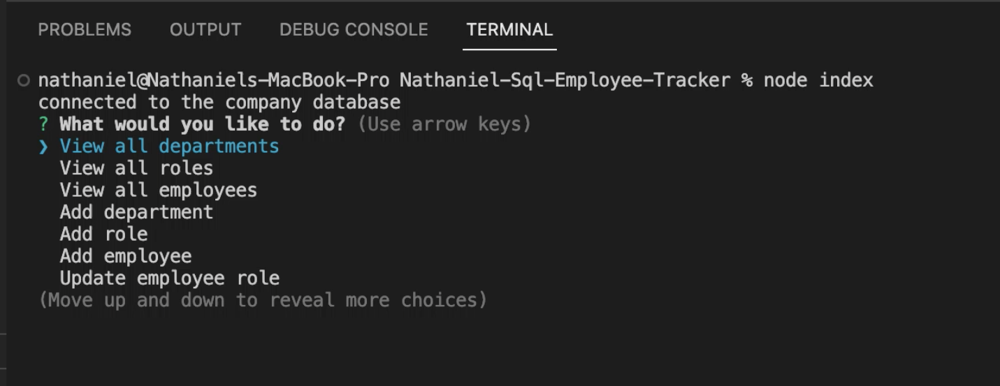
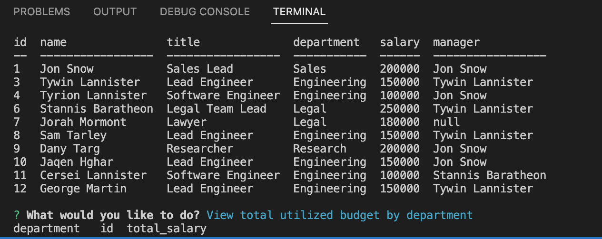

# Nathaniel-Sql-Employee-Tracker
## Description
#
A command line application in the form of a Content Management System that lets the user manage employees, roles, and departments. 

## Installation 
#
This app was created using node.js and npm installations such as console.table, inquirer, and mysql2. The database was created using schema and seeds files which were initialized through running mysql. A mysql connection in the index.js files were made through module exports.

## Usage
#
The user prompts the application by the command node index. A "what would you like to do?" menu pops up in the terminal for the user. From here the user is able to add departments, roles, and employees. The user is also able to update - as well as delete - an employee and their role at any time in the menu. Other viewing options allow the user the to see managers, departments, and the total budget of a department. 

## Credits
#
Credit goes to UCI for providing the assignment. 

## License
#
N/A
## Deployment 
(https://nathaniel-note-taker.herokuapp.com/)

